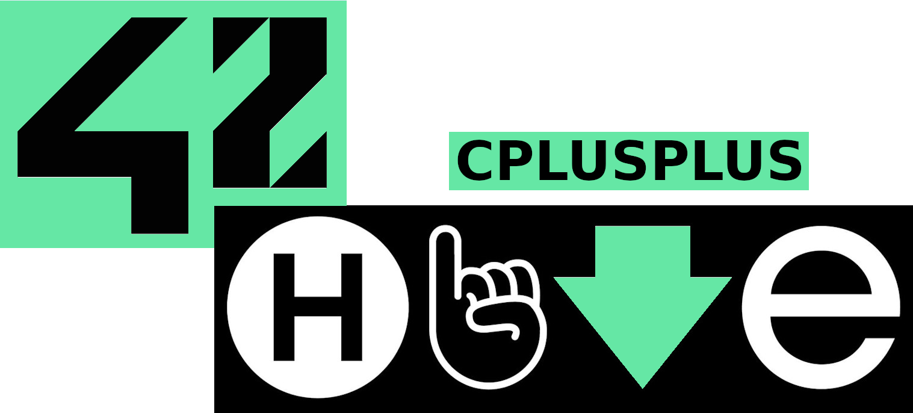

<h1 align="center">
  
</h1>

<p align="center">
    <b><i>Modularized practices of learning C++ concepts.</i></b><br>
</p>

<p align="center">
  
  
	
  
</p>

<p align="center">
    
  
</p>

<div align="center">

## Table of Contents
[📝 General](#-general)
[🛠️ Build](#️-build)
[⚡ Usage](#-usage)
[🚀 Details](#-details)
[♻️ Resources](#️-resources)

</div>

## 📝 General

Collection on all C++ modules 00-09.

## 🛠️ Build

GNU `make` and `gcc` are required to build and compile each excersice.

```bash
git clone https://github.com/Jarnomer/cplusplus.git
```

```bash
cd cplusplus/mod00/ex00 && make all
```

## 🚀 Details

| Module        | Topics                                                          |
|---------------|-----------------------------------------------------------------|
| Module 00     | Classes, member functions, access specifiers and streams        |
| Module 01     | Memory management, pointers and references                      |
| Module 02     | Orthodox canonical form, polymorphism and operator overloading  |
| Module 03     | Inheritance                                                     |
| Module 04     | Polymorphism, abstract classes and interfaces                   |
| Module 05     | Custom exceptions and exception handling                        |
| Module 06     | Type casting                                                    |
| Module 07     | Templates                                                       |
| Module 08     | Containers, algorithm library and iterators                     |
| Module 09     | STL Standard Template Library with containers                   |

## ♻️ Resources

[LearnCpp](https://www.learncpp.com/) covers everything from the absolute basics to advanced topics.

[CppReference](https://en.cppreference.com/w/) best reference documentation with simple search.

[The C++ Programming language](https://www.youtube.com/watch?v=LGOgNqkRMs0&list=PLvv0ScY6vfd8j-tlhYVPYgiIyXduu6m-L) excellent video playlist by Mike Shah.

[Ford-Johnson](https://dev.to/emuminov/human-explanation-and-step-by-step-visualisation-of-the-ford-johnson-algorithm-5g91) Medium article on sorting algorithm for mod09/ex02.

## 4️⃣2️⃣ Footer

For my other 42 projects and general information, please refer the [Hive42](https://github.com/Jarnomer/Hive42) page.

I have also created error handling [unit testers](https://github.com/Jarnomer/42Testers) for `pipex`, `so_long` and `cub3D`.

### Cheers and good luck! 🥳